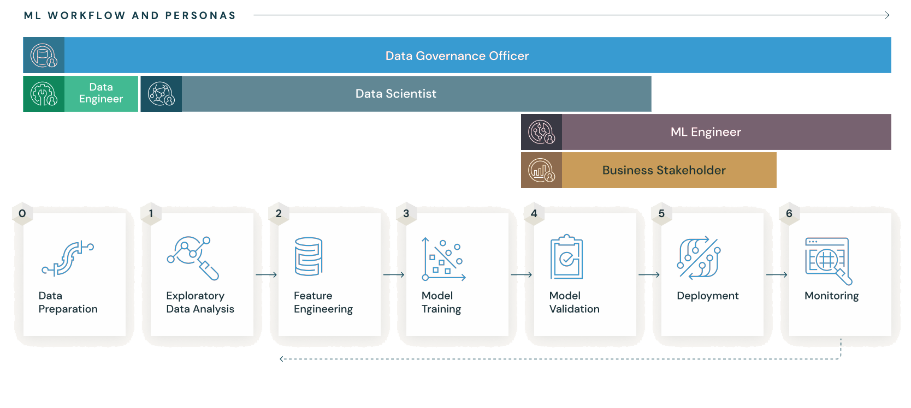

# MLFLOW
MLFLOW Toturial


## 1. Cài đặt MLFlow
```
!docker build -t mlflow .
!docker run mlflow
```
Sau khi cài đặt xong thì mlflow sẽ mở ở port 5000

## 2. MLFLlow Tracking
```
import mlflow

mlflow.set_tracking_uri('http://localhost:5000')
mlflow.set_experiment("Model_Training")

with mlflow.start_run():
    mlflow.log_param("learning_rate", 0.01)
    mlflow.log_param("optimizer", "Adam")
    mlflow.log_metric("accuracy", 0.95)

    print("Logging completed")
```
- Đoạn code này mô tả việc tạo một experiment (thí nghiệm) mà tất cả các logs - (tham số, metrics, mô hình, v.v.) sẽ được lưu trữ.
- File Template cung cấp có hỗ trợ log tham số của 3 framework (Pytorch, Tensorflow, HuggingFace)